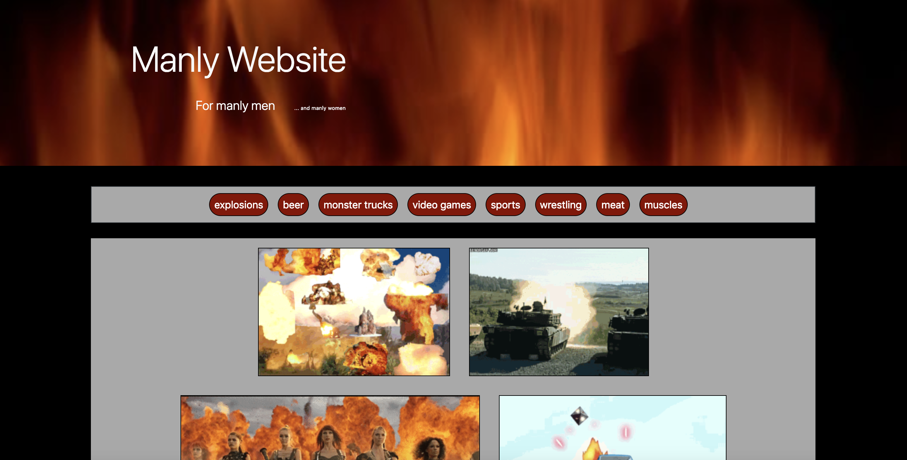

# 06-API-Homework

## What I was supposed to be doing:
For this assignment, I was tasked with making a gif gallery generated through the giphy API

## Tools used:
* HTML
* CSS
* JavaScript
* JQuery
* Giphy API
* Bootstrap

## How I did it:
The first thing I did was using a for loop to take elements out of an array, and make buttons with values from them using JQuery. I then set it up so that when a button was clicked an ajax call was registered and the still versions of gifs were appended to a div created for them and given attributes that could be used to animate them. Lastly I set up a click listener so that gifs would alternate between their still and active versions whenever they were clicked.

## Issues:
This assignment was relatively easy for me, the only thing I had trouble with was the URL syntax for the ajax call
